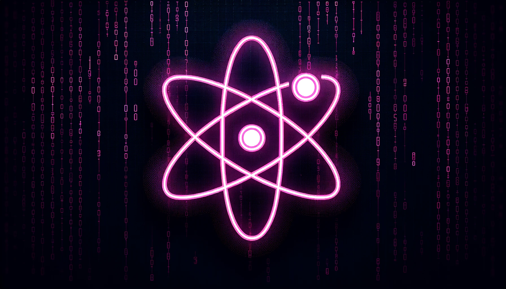

# React JS Full Course for Beginners

This repository contains code and resources for an all-in-one beginner's course in React JS. The course spans nearly 9 hours and covers modern React development using functional components and hooks.

## Table of Contents

0. **[Intro](#intro)**
1. **[Start Here](#start-here)**
2. **[App & JSX](#app--jsx)**
3. **[Functional Components](#functional-components)**
4. **[Applying CSS Styles](#applying-css-styles)**
5. **[Click Events](#click-events)**
6. **[useState Hook](#usestate-hook)**
7. **[Lists & Keys](#lists--keys)**
8. **[Props & Prop Drilling](#props--prop-drilling)**
9. **[Controlled Component Inputs](#controlled-component-inputs)**
10. **[Project Challenge](#project-challenge)**
11. **[useEffect Hook](#useeffect-hook)**
12. **[JSON Server](#json-server)**
13. **[Fetch API Data](#fetch-api-data)**
14. **[CRUD Operations](#crud-operations)**
15. **[Fetch Data Challenge](#fetch-data-challenge)**
16. **[React Router](#react-router)**
17. **[Router Hooks & Links](#router-hooks--links)**
18. **[Flexbox Components](#flexbox-components)**
19. **[Axios API Requests](#axios-api-requests)**
20. **[Custom Hooks](#custom-hooks)**
21. **[Context API & useContext Hook](#context-api--usecontext-hook)**
22. **[Easy Peasy Redux](#easy-peasy-redux)**
23. **[Build & Deploy Your React Apps](#build--deploy-your-react-apps)** 

---

## Chapter Descriptions

1. **Start Here**: This chapter provides an introduction to the React ecosystem and sets up the development environment.
2. **App & JSX**: Learn the basics of JSX syntax and how to create your first React app.
3. **Functional Components**: Dive into functional components and understand their role in React.
4. **Applying CSS Styles**: Learn how to style your React components using CSS.
5. **Click Events**: Understand how to handle click events in React.
6. **useState Hook**: Get to know the `useState` hook for managing component state.
7. **Lists & Keys**: Learn how to render lists and understand the importance of keys.
8. **Props & Prop Drilling**: Understand how to pass data between components using props.
9. **Controlled Component Inputs**: Learn how to create controlled components with form inputs.
10. **Project Challenge**: A hands-on challenge to test your understanding of React basics.
11. **useEffect Hook**: Explore the `useEffect` hook and its use-cases.
12. **JSON Server**: Set up a JSON server to mock a backend for your React app.
13. **Fetch API Data**: Learn how to fetch data from an API using React.
14. **CRUD Operations**: Understand Create, Read, Update, and Delete operations in React.
15. **Fetch Data Challenge**: A challenge to test your skills in fetching data in React.
16. **React Router**: Learn how to navigate between different routes in your React app.
17. **Router Hooks & Links**: Understand the hooks and links provided by React Router.
18. **Flexbox Components**: Learn how to create flexible layouts using Flexbox in React.
19. **Axios API Requests**: Get to know Axios for making API requests in your React app.
20. **Custom Hooks**: Learn how to create and use custom hooks in React.
21. **Context API & useContext Hook**: Understand the Context API and how to manage global state.
22. **Easy Peasy Redux**: Learn how to manage complex state using Easy Peasy and Redux.
23. **Build & Deploy Your React Apps**: A guide on how to build and deploy your React applications.

--- 

### Credits

This course is based on the tutorial by [Dave Gray](https://www.youtube.com/channel/UCY38RvRIxYODO4penyxUwTg). You can watch the full tutorial on [YouTube](https://www.youtube.com/watch?v=EfAl9bwzVZk&ab_channel=DaveGray).

---
